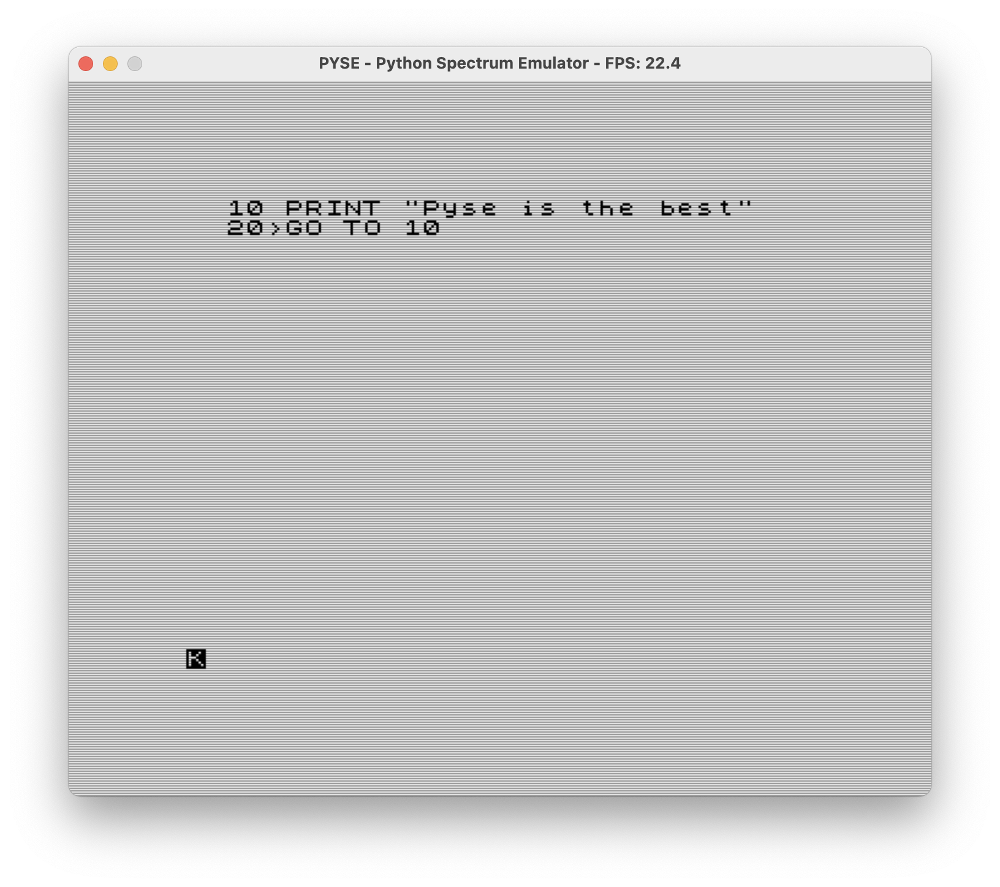
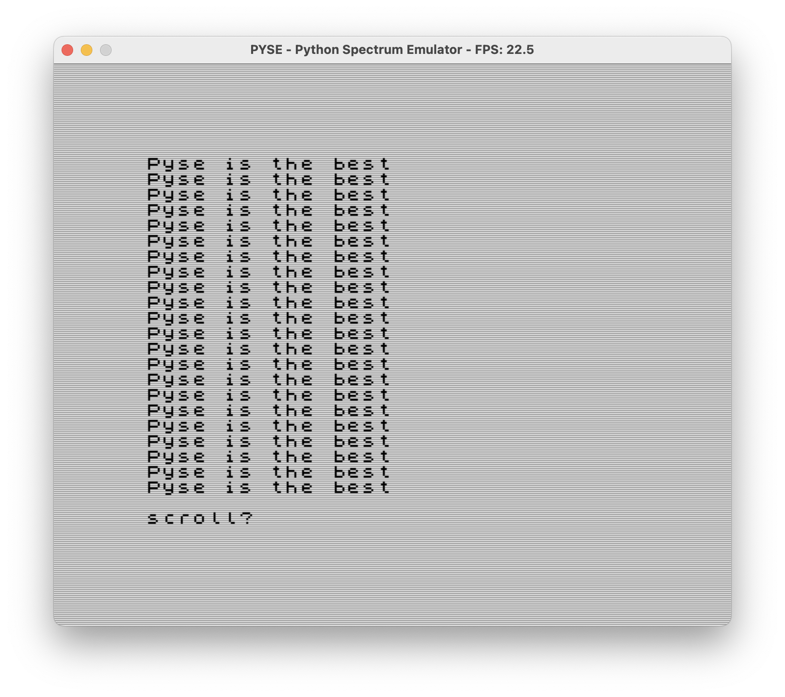

# PYSE - Python Spectrum Emulator

PYSE is a ZX Spectrum emulator written in Python, designed to accurately emulate the classic 48K ZX Spectrum home computer.





## Features

- Full Z80 CPU emulation
- Accurate ULA (Uncommitted Logic Array) timing and display generation
- CRT simulation with interlaced display
- Keyboard input emulation
- Support for multiple file formats (.rom, .sna, .scr)
- Rendering using SDL2

## Requirements

- Python 3
- NumPy
- Numba
- PySDL2
- pyz80 (included in vendor directory)

## Installation

1. Clone this repository:
   ```
   git clone https://github.com/finnless/pyse.git
   cd pyse
   ```

2. Install dependencies:
   ```
   pip install -r requirements.txt
   ```

3. Make sure you have a ZX Spectrum ROM file (e.g., `48.rom`) in the project directory.

## Usage

Run the emulator with:

```
python pyse.py [options] [files]
```

### Command Line Options

- `-h`, `--help`: Display help information


### File Formats

- `.rom`: System ROM file (16KB)
- `.sna`: Snapshot file (49179 bytes)
- `.scr`: Screen data file (6912 bytes)

If no ROM file is specified, the emulator will attempt to load `48.rom` from the current directory.

### Examples

Load a specific ROM:
```
python pyse.py custom.rom
```

Load a snapshot:
```
python pyse.py game.sna
```

Load a screen file:
```
python pyse.py screen.scr
```
